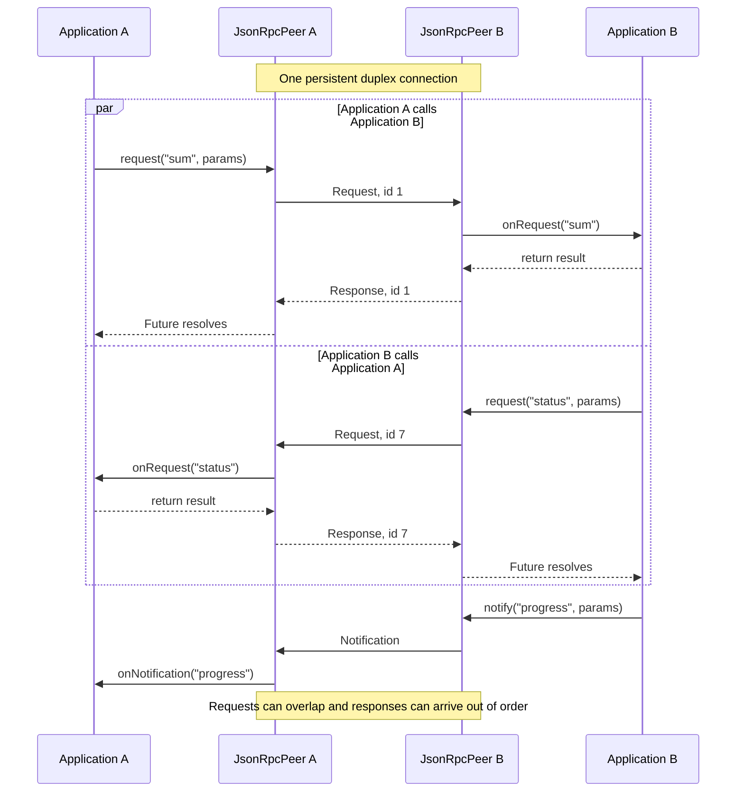
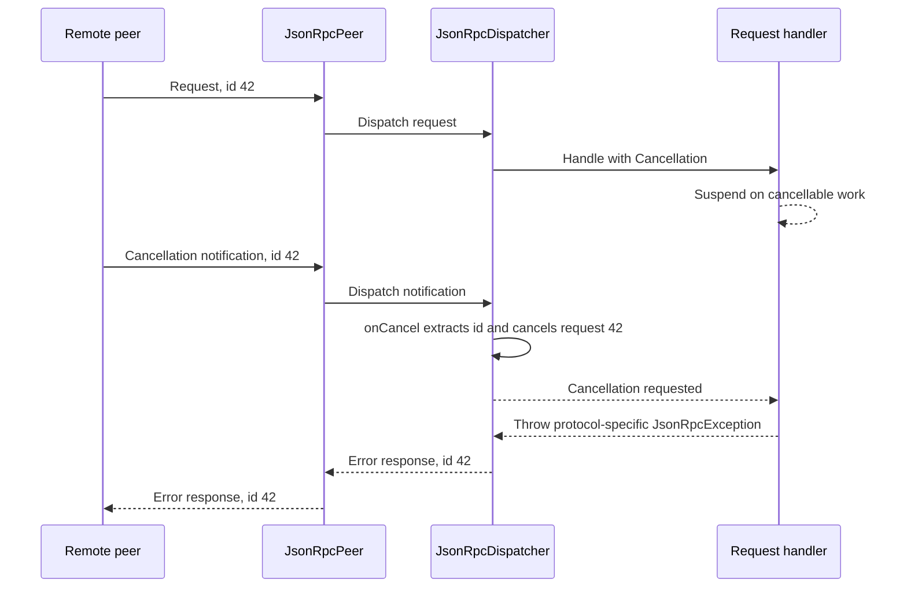

# JSON-RPC

A minimal, asynchronous, bidirectional [JSON-RPC 2.0](https://www.jsonrpc.org/specification)
peer over line-delimited JSON streams, built on [amphp](https://amphp.org) byte
streams and the [Revolt](https://revolt.run) event loop.

This is a **peer** JSON-RPC library: a single long-lived connection over which
both sides send requests and notifications, answer inbound requests, and
resolve responses out of order. It is the primitive behind stdio protocols such
as the [Language Server
Protocol](https://microsoft.github.io/language-server-protocol/) and the [Model
Context Protocol](https://modelcontextprotocol.io).



## Spec conformance

The peer implements JSON-RPC 2.0, including mixed request and notification
batches.

## Why this exists

The PHP ecosystem has plenty of JSON-RPC libraries, but they model one HTTP
request mapping to one response, are strictly a server or a client, run
synchronously, and cannot let the endpoint initiate a call back to the other
side. Bidirectional stdio protocols need none of that shape and all of what is
missing:

- **Peer**: the same endpoint serves inbound requests and emits its own
  requests and notifications.
- **Persistent duplex transport**: line-delimited JSON over any amphp
  `ReadableStream`/`WritableStream` (stdio, a socket, or in-memory streams for
  tests).
- **Concurrent requests**: each inbound request runs in its own coroutine, so
  handlers can suspend on asynchronous work while the peer keeps processing
  other messages on the same connection.

## Installation

```bash
composer require fabpot/json-rpc-peer
```

## Usage

### Wiring a peer

```php
use Amp\ByteStream;
use Fabpot\JsonRpc\JsonRpcDispatcher;
use Fabpot\JsonRpc\JsonRpcPeer;

$input = ByteStream\getStdin();
$output = ByteStream\getStdout();

$peer = new JsonRpcPeer($input, $output);
$dispatcher = new JsonRpcDispatcher($peer);
```

### Handling requests and notifications

Register handlers by method name. A request handler returns its result; the
dispatcher sends it as the JSON-RPC response.

```php
$dispatcher->onRequest('sum', function (array $params): array {
    return ['total' => array_sum($params['values'])];
});
```

A notification handler returns nothing because notifications have no response:

```php
$dispatcher->onNotification('log', function (array $params): void {
    fwrite(\STDERR, $params['message']."\n");
});
```

### Running the peer

After registering handlers, call `listen()`. It reads and dispatches messages
until the input stream reaches EOF or is closed. It then requests cancellation
of active request handlers and waits for them to finish before returning:

```php
$peer->listen();
```

### Error responses

`JsonRpcError` defines all error codes reserved by JSON-RPC 2.0:

| Constant | Code | When it is used |
| --- | ---: | --- |
| `PARSE_ERROR` | `-32700` | The peer received malformed JSON. |
| `INVALID_REQUEST` | `-32600` | The decoded message is not a valid JSON-RPC request. |
| `METHOD_NOT_FOUND` | `-32601` | No request handler is registered for the method. |
| `INVALID_PARAMS` | `-32602` | A request handler rejects its method parameters. |
| `INTERNAL_ERROR` | `-32603` | A request handler fails unexpectedly or its result cannot be encoded. |

The peer emits `PARSE_ERROR`, `INVALID_REQUEST`, and `METHOD_NOT_FOUND`
automatically. Malformed lines receive a `PARSE_ERROR` response and are skipped,
so a single bad line does not stop the listener. The peer also converts
unexpected exceptions to `INTERNAL_ERROR` without exposing their messages.

A request handler can throw `JsonRpcException` with `INVALID_PARAMS` when its
parameters are valid JSON-RPC but invalid for that method:

```php
use Fabpot\JsonRpc\Exception\JsonRpcException;
use Fabpot\JsonRpc\JsonRpcError;

$dispatcher->onRequest('divide', function (array $params): float|int {
    if (!is_int($params['value'] ?? null) || !is_int($params['by'] ?? null)) {
        throw new JsonRpcException(JsonRpcError::INVALID_PARAMS, 'Expected integer "value" and "by" parameters.');
    }

    if (0 === $params['by']) {
        throw new JsonRpcException(JsonRpcError::INVALID_PARAMS, 'Cannot divide by zero.');
    }

    return $params['value'] / $params['by'];
});
```

Handlers may also throw `JsonRpcException` with an application-defined code for
errors outside the reserved JSON-RPC codes, as shown in the cancellation
example below. At an application boundary, translate domain exceptions to
`JsonRpcException` in the registered handler rather than coupling application
services to JSON-RPC error codes.

### Long-running requests and cancellation

Each request handler runs in its own coroutine, so it may use suspending Amp
APIs without blocking the peer. The dispatcher creates an Amp `Cancellation`
for every inbound request and passes it as the optional second argument. The
callable type accepts user-defined handlers both with and without this argument,
so static analysis does not require a wrapper. Internally implemented PHP
callables must accept both arguments. A handler that supports cancellation
passes it to Amp APIs or checks it between units of work:

```php
use Amp\Cancellation;
use function Amp\delay;

function processItems(array $items, Cancellation $cancellation): array
{
    $results = [];

    foreach ($items as $item) {
        $cancellation->throwIfRequested();
        delay(0.1, cancellation: $cancellation);
        $results[] = processItem($item);
    }

    return $results;
}
```

Cancellation is cooperative: the handler notices a cancellation request when it
reaches `throwIfRequested()` or suspends in an Amp API that received the
`Cancellation`. The dispatcher also requests cancellation of every active
handler when the input stream closes.

Request handlers do not need to create a `Future` or call `Amp\async()`; the
dispatcher already runs them in a coroutine:

```php
use Amp\Cancellation;
use Amp\CancelledException;
use Fabpot\JsonRpc\Exception\JsonRpcException;

$dispatcher->onRequest('run', function (array $params, Cancellation $cancellation): array {
    try {
        return processItems($params['items'], $cancellation);
    } catch (CancelledException) {
        throw new JsonRpcException(-32000, 'Request canceled.');
    }
});
```

JSON-RPC does not define the response to a canceled request, so the handler
chooses the result or error. Here, `-32000` is an application-defined error
code.

JSON-RPC does not define a cancellation notification or its parameters. Before
calling `listen()`, register the convention used by your protocol with
`onCancel()`. Pass both the notification method and the parameter containing the
ID of the inbound request to cancel:

```php
$dispatcher->onCancel('cancel', 'requestId');
```

For example, while the handler for this inbound request is running:

```json
{"jsonrpc":"2.0","id":42,"method":"run","params":{"items":[]}}
```

The remote peer can then send this notification. The registered notification
handler calls `cancelRequest(42)`:

```json
{"jsonrpc":"2.0","method":"cancel","params":{"requestId":42}}
```

The Language Server Protocol uses a different notification method and names the
ID parameter `id`:

```php
$dispatcher->onCancel('$/cancelRequest', 'id');
```

For a cancellation payload that cannot be described by a top-level parameter,
use `onNotification()` and `cancelRequest()` directly:

```php
$dispatcher->onNotification('custom/cancel', function (array $params) use ($dispatcher): void {
    $dispatcher->cancelRequest($params['request']['id']);
});
```



### Emitting requests and notifications

Outbound requests return an Amp `Future`. Responses are matched by ID, so they
can arrive in any order. Remote JSON-RPC errors throw a `JsonRpcException` when
the future is awaited.

`listen()` must process the response while the request is pending, so run it in
a separate coroutine. Await the listener when shutting down to ensure it has
stopped:

```php
$listener = \Amp\async($peer->listen(...));

$result = $peer->request('workspace/status', [
    'workspace' => '/project',
])->await();

$input->close();
$listener->await();
```

Calling `$input->close()` is the local way to stop `listen()`; an EOF caused by
the remote side closing its output stops it as well. When the input closes, all
outstanding outbound requests fail with a
`Fabpot\JsonRpc\Exception\ConnectionClosedException`. New requests throw the
same exception after the listener stops.

The peer can also push notifications to the other side at any time:

```php
$peer->notify('progress', ['percent' => 42]);
```

#### Batches

For protocols that use JSON-RPC batches, pass explicit request and notification
entries. The returned array contains futures for request entries only, in the
same order as those requests:

```php
use Fabpot\JsonRpc\BatchNotification;
use Fabpot\JsonRpc\BatchRequest;

[$status, $configuration] = $peer->batch(
    new BatchRequest('workspace/status'),
    new BatchNotification('progress', ['percent' => 42]),
    new BatchRequest('workspace/configuration'),
);

$status = $status->await();
$configuration = $configuration->await();
```

When the peer receives a batch, it sends one response after every request in the
batch settles. Notifications are omitted, and response entries may follow
settlement order rather than input order. For example, this inbound batch:

```json
[
    {"jsonrpc":"2.0","id":1,"method":"slow"},
    {"jsonrpc":"2.0","method":"progress"},
    {"jsonrpc":"2.0","id":2,"method":"fast"}
]
```

It can produce this response if `fast` settles before `slow`:

```json
[
    {"jsonrpc":"2.0","id":2,"result":"fast"},
    {"jsonrpc":"2.0","id":1,"result":"slow"}
]
```

## Traffic logging

Pass a `TrafficLoggerInterface` to the peer to record raw inbound and outbound
lines. `PsrTrafficLogger` forwards them to a PSR-3 logger at the `debug` level
and recursively redacts common credential keys and credentials in values that
are URLs. Pass additional protocol-specific sensitive keys as the second
argument:

```php
use Fabpot\JsonRpc\PsrTrafficLogger;

$trafficLogger = new PsrTrafficLogger($logger, [
    'privateKey',
]);
$peer = new JsonRpcPeer($input, $output, $trafficLogger);
```

The adapter always redacts common credential keys such as `authorization`,
`token`, `password`, and `secret`. Redaction is intentionally conservative and
does not inspect arbitrary text for embedded credentials. Install `psr/log` to
use this optional adapter.
